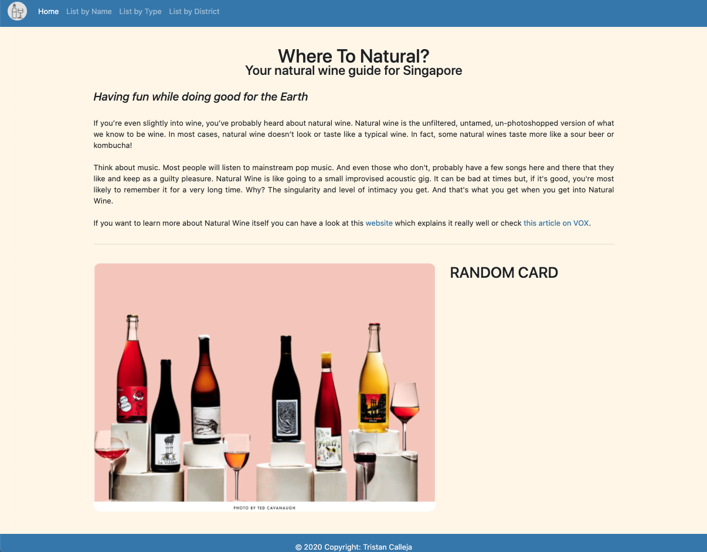
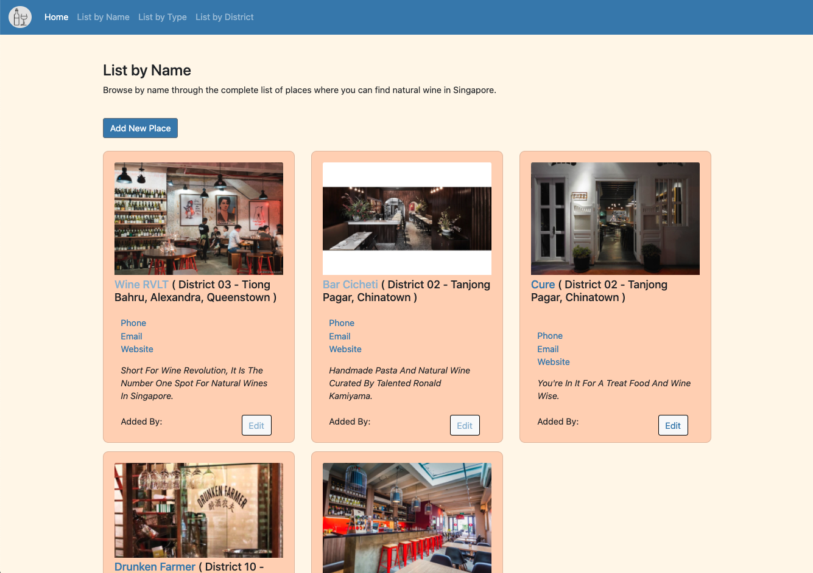
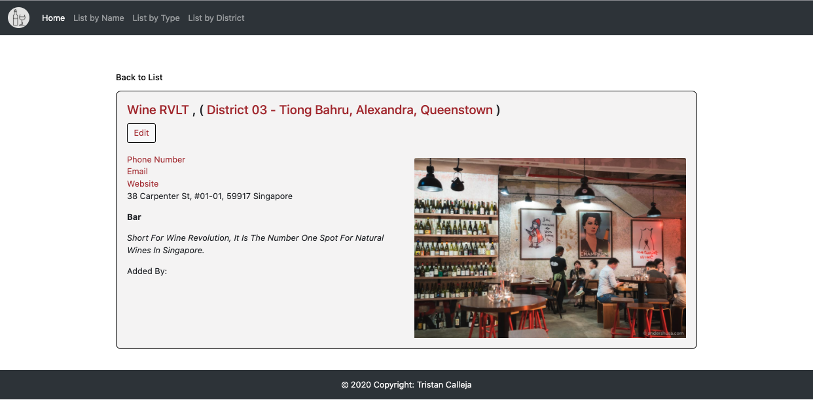
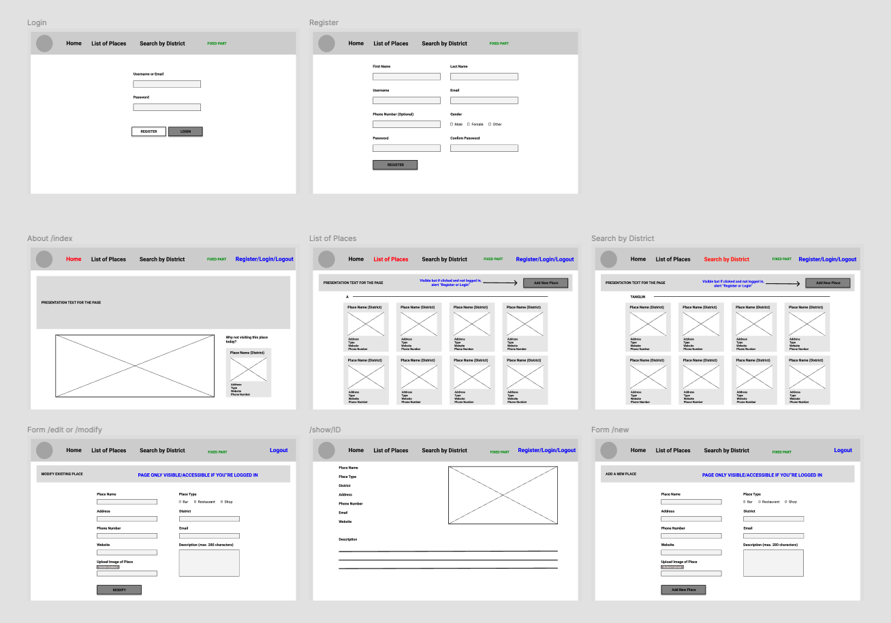

# Where To Natural #
## Your natural wine guide for Singapore #

---

[Heroku link to *"Where To Natural"*](https://project2-wheretonatural.herokuapp.com/)

## **Goal** #

Natural Wine Consumption is on the rise throughout the world and Singapore is no different. However, there isn’t really a tool that allows you to find them and it’s easy to get lost when searching on wine, especially when starting on the topic.

Your solutions right now are:

- To scan through the articles that come on top of your research on Google for bars, restaurants, etc.
- Download Raisin, an app specialised in that. But you have to find out that it exists and to sign up, etc.

My goal is to bring a list of places that serve natural wines and where this category on the rise makes at least 50% of the wine list with natural/biodynamic wines.\

## **Technologies Used** #

- Nodejs
- Express
- EJS
- Bootstrap
- Multer
- Sharp

## **Features** #

The home page is mainly informative but the aim is to later be able to display a random "card" picked from the database everytime this page loads.

The 3 titles in the nav bar at the top are where most things happen.

In "List by Name" for example, users will be able to see all the natural wine bars, restaurants and shops that will have been added by the users.

The database will be populated by users and should provide basic information of the places listed as follow.

The database basics are working but everything is pretty raw as of now.

## **Unsolved Problems and Future Plans** #

***Unsolved Problems:***

- **Fix Edit Places Bug** for images and district so that information on edited object is displaying when landing on the page.
- **Fix Edit District Bug** to remove the places from the places array populated at place creation. Ideally change to model with automation.
- **Resizing Images at Upload** so that they fit a standard and it doesn't affect too much the card display.
- **Card Display in List by Type** needs to be improved so that on bigger screens it displays 3 cards per row.

***Future Plans:***

- **Display Random Card on Homepage** 
- **Add Authentication** so that only users can add new places to the database. Also get the username of the person who created the place to display on its card.
- **More interconnection between pages** by adding more models.
- **Get the unused img uploads to be automatically deleted if not part of an object**.
- **Geolocalisation**

## **Wireframes** #

[Link to project 2 wireframes on Figma](https://www.figma.com/file/juyJBZCyv9o0VKJOTgZk6i/Project-2-WhereToNatural.sg?node-id=0%3A1)

